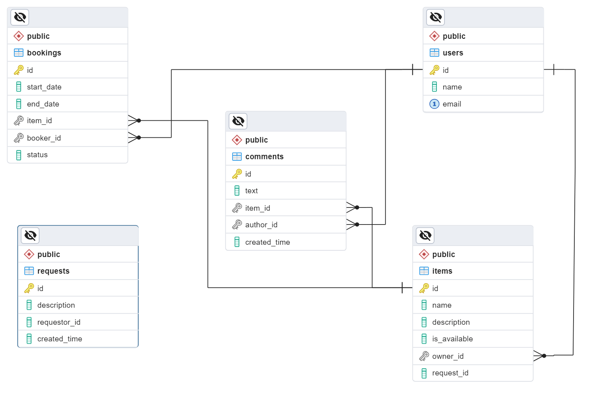

# ShareIt

ShareIt - сервис для шеринга вещей, созданный с целью участия в развитии совместной экономики. Прогнозируемый глобальный рынок шеринга ожидается достичь $335 млрд к 2025 году. ShareIt позволяет пользователям делиться вещами, сокращая потребность в покупке или услугах. ShareIt упрощает процесс обмена вещами, делая его более удобным и эффективным. Приложение разделено на две части: `shareIt-server` и `shareIt-gateway`, обеспечивая валидацию входных данных и кэширование для улучшения производительности основного приложения.

## Основные функции

- **Добавление вещей**: Пользователи могут добавлять вещи для шеринга, указывая название, описание и статус доступности для аренды.
- **Поиск вещей**: Возможность поиска вещей по текстовому запросу, с возможностью бронирования на определенные даты.
- **Управление вещами**: Владельцы вещей могут подтверждать бронирования и редактировать информацию о своих вещах.
- **Отзывы**: После возврата вещи арендатор может оставить отзыв.
- **Добавление запросов**: Пользователи могут добавлять запросы на вещи, которые отсутствуют в сервисе.

## Основные эндпойнты

- **Добавление новой вещи**: `POST /items`
- **Редактирование вещи**: `PATCH /items/{itemId}` (только для владельца)
- **Просмотр информации о вещи**: `GET /items/{itemId}`
- **Просмотр списка вещей владельца**: `GET /items`
- **Поиск вещей по тексту**: `GET /items/search?text={text}` (только доступные для аренды)

## Технологический стек

- Java, Spring Boot, Spring Data JPA, Spring MVC, Hibernate, Docker, PostgreSQL.

## Настройка и развертывание

### Системные требования

- Java 11
- Docker
- PostgreSQL

### Инструкция по развёртыванию

1. Склонируйте репозиторий: `git clone https://github.com/EugeneP87/java-shareit.git`
2. Запустите PostgreSQL с использованием Docker.
3. Настройте базу данных с помощью `schema.sql`.
4. Запустите `shareIt-server` и `shareIt-gateway`.
5. Проверьте, что приложение работает, обратившись к эндпойнтам.

## Дополнительная информация

- **База данных**: Создана с отдельными таблицами для каждой основной сущности и отзывов.
- **Бронирование**: Добавлена возможность бронирования вещей на определенные даты.
- **Отзывы**: Реализована возможность добавления отзывов к вещам.
- **Запросы на вещи**: Добавлены эндпойнты для работы с запросами на вещи.
- **Тестирование**: Разработаны тесты, включая функциональные и нефункциональные требования.

## Диаграмма базы данных

На диаграмме базы данных отображены основные таблицы, представляющие вещи, пользователей, отзывы и другие сущности. Отношения между таблицами демонстрируют, как связаны различные компоненты системы. Это помогает лучше понять структуру базы данных и взаимодействие между различными частями приложения.

